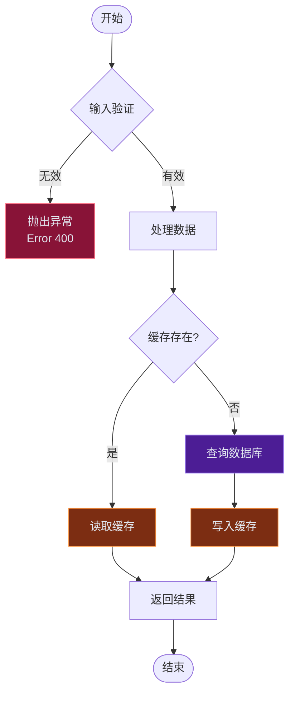
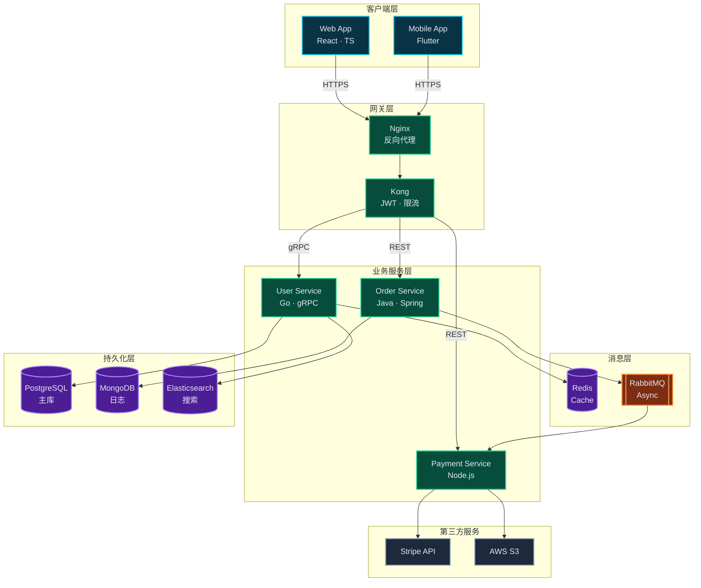
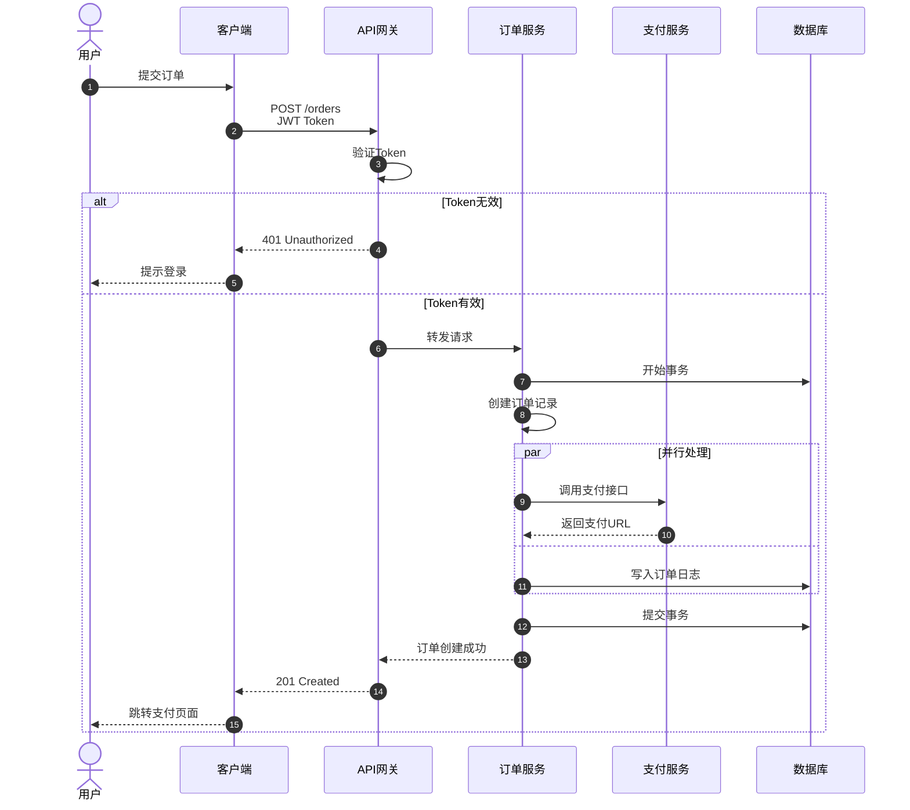
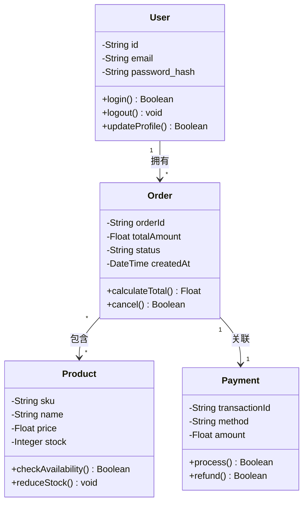
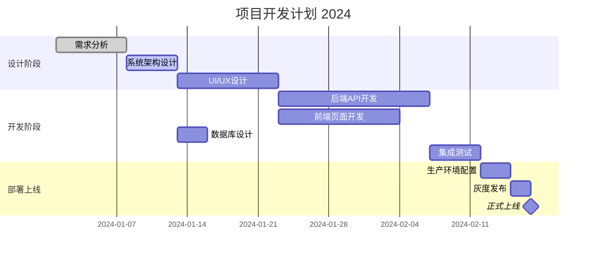
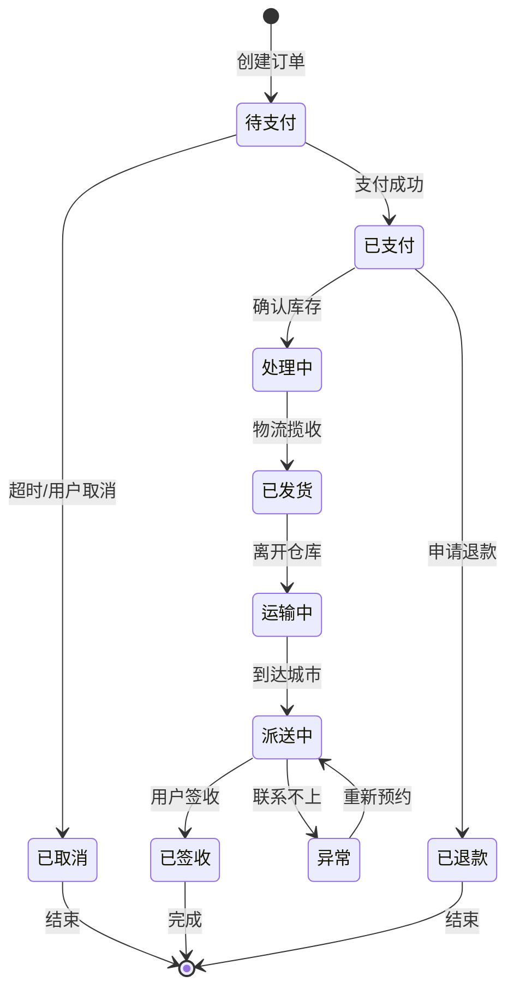
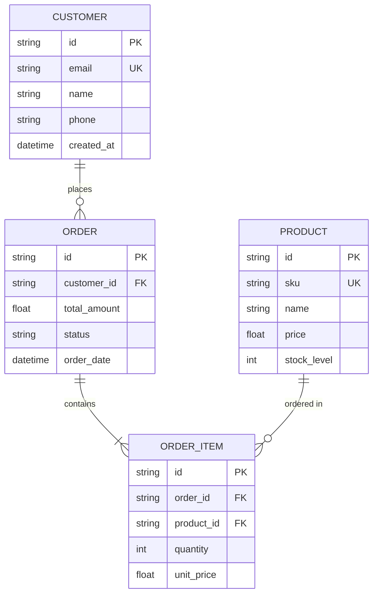

```markdown
# 综合 Markdown 元素演示文档

本文档展示 **GitHub Flavored Markdown** 的全部核心能力，涵盖数学公式、多类型图表、代码高亮及表格布局。

---

## 1. 数学公式

### 行内公式
质能方程 E=mc^2 与欧拉公式 e^{i\pi} + 1 = 0 是物理学中最美的等式。
对于任意向量 \mathbf{v} \in \mathbb{R}^n，其范数定义为 \|\mathbf{v}\| = \sqrt{\sum_{i=1}^{n} v_i^2}。

### 块级公式（微分几何）
高斯-博内定理描述曲面曲率与拓扑的关系：

\int_M K \, dA + \int_{\partial M} k_g \, ds = 2\pi \chi(M)


### 矩阵与线性代数
矩阵乘法示例，其中 \mathbf{A} \in \mathbb{R}^{m \times n}，\mathbf{x} \in \mathbb{R}^n：

\mathbf{A}\mathbf{x} = 
\begin{pmatrix}
a_{11} & a_{12} & \cdots & a_{1n} \\
a_{21} & a_{22} & \cdots & a_{2n} \\
\vdots & \vdots & \ddots & \vdots \\
a_{m1} & a_{m2} & \cdots & a_{mn}
\end{pmatrix}
\begin{pmatrix}
x_1 \\
x_2 \\
\vdots \\
x_n
\end{pmatrix}
= 
\begin{pmatrix}
\sum_{j=1}^{n} a_{1j}x_j \\
\sum_{j=1}^{n} a_{2j}x_j \\
\vdots \\
\sum_{j=1}^{n} a_{mj}x_j
\end{pmatrix}


### 概率论
条件概率与贝叶斯定理：

P(A|B) = \frac{P(B|A)P(A)}{P(B)} \quad \text{其中} \quad P(B) = \sum_{i} P(B|A_i)P(A_i)


---

## 2. Mermaid 图表

### 2.1 基础流程图（算法决策）



### 2.2 系统架构图（微服务）



### 2.3 时序图（Sequence Diagram）



### 2.4 类图（Class Diagram）



### 2.5 甘特图（Gantt Chart）



### 2.6 状态图（State Diagram）



### 2.7 ER 图（实体关系）



---

## 3. 代码块示例

### Python（数据科学）

```python
import numpy as np
import pandas as pd
from typing import List, Tuple

def gradient_descent(
    X: np.ndarray, 
    y: np.ndarray, 
    lr: float = 0.01, 
    epochs: int = 1000
) -> Tuple[np.ndarray, List[float]]:
    """
    实现线性回归的梯度下降算法
    参数:
        X: 特征矩阵 (m, n)
        y: 目标向量 (m,)
        lr: 学习率 \alpha
        epochs: 迭代次数 T
    返回:
        weights: 权重向量 \theta
        losses: 损失历史 J(\theta)
    """
    m, n = X.shape
    theta = np.zeros(n)
    losses = []
    
    for t in range(epochs):
        # 预测值 \hat{y} = X\theta
        predictions = X @ theta
        errors = predictions - y
        
        # 计算梯度 \nabla J = \frac{1}{m} X^T (X\theta - y)
        gradient = (X.T @ errors) / m
        
        # 更新参数 \theta := \theta - \alpha \nabla J
        theta -= lr * gradient
        
        # 计算 MSE 损失 J(\theta) = \frac{1}{2m} \sum (h_\theta(x^{(i)}) - y^{(i)})^2
        loss = np.mean(errors ** 2) / 2
        losses.append(loss)
        
        if t % 100 == 0:
            print(f"Epoch {t}: Loss = {loss:.4f}")
    
    return theta, losses
```

### Rust（系统编程）

```rust
use std::sync::Arc;
use tokio::sync::RwLock;

/// 线程安全的缓存结构
pub struct Cache<K, V> {
    store: Arc<RwLock<std::collections::HashMap<K, V>>>,
    ttl: std::time::Duration,
}

impl<K: Eq + std::hash::Hash + Clone, V: Clone> Cache<K, V> {
    pub fn new(ttl_seconds: u64) -> Self {
        Self {
            store: Arc::new(RwLock::new(std::collections::HashMap::new())),
            ttl: std::time::Duration::from_secs(ttl_seconds),
        }
    }
    
    /// 获取值，如果不存在返回 None
    pub async fn get(&self, key: &K) -> Option<V> {
        let store = self.store.read().await;
        store.get(key).cloned()
    }
    
    /// 插入值
    pub async fn set(&self, key: K, value: V) {
        let mut store = self.store.write().await;
        store.insert(key, value);
    }
}
```

### SQL（数据库查询）

```sql
-- 查询过去30天每个类别的销售总额
WITH monthly_sales AS (
    SELECT 
        p.category_id,
        c.name AS category_name,
        SUM(oi.quantity * oi.unit_price) AS total_revenue,
        COUNT(DISTINCT o.id) AS order_count
    FROM orders o
    JOIN order_items oi ON o.id = oi.order_id
    JOIN products p ON oi.product_id = p.id
    JOIN categories c ON p.category_id = c.id
    WHERE o.created_at >= CURRENT_DATE - INTERVAL '30 days'
        AND o.status = 'completed'
    GROUP BY p.category_id, c.name
)
SELECT 
    category_name,
    total_revenue,
    order_count,
    ROUND(total_revenue / NULLIF(order_count, 0), 2) AS avg_order_value
FROM monthly_sales
ORDER BY total_revenue DESC;
```

---

## 4. 表格展示

### 基础对齐

| 算法 | 时间复杂度 | 空间复杂度 | 稳定性 |
|:---:|:---:|:---:|:---:|
| 快速排序 | O(n \log n) | O(\log n) | ❌ 不稳定 |
| 归并排序 | O(n \log n) | O(n) | ✅ 稳定 |
| 堆排序 | O(n \log n) | O(1) | ❌ 不稳定 |
| 计数排序 | O(n + k) | O(k) | ✅ 稳定 |

### 系统性能指标

| 服务 | QPS | 延迟 P_{99} | 错误率 | 状态 |
|----|:---:|:---:|:---:|:---:|
| User Service | 12,000 | 25ms | 0.01% | 🟢 健康 |
| Order Service | 8,500 | 45ms | 0.05% | 🟢 健康 |
| Payment Service | 3,200 | 120ms | 0.2% | 🟡 警告 |
| Notification | 15,000 | 15ms | 0.001% | 🟢 健康 |

---

## 5. 其他 GFM 特性

### 任务列表
- [x] 完成架构设计文档
- [x] 实现用户认证模块 HMAC_{SHA256}
- [ ] 优化数据库查询（目标：减少 N+1 问题）
- [ ] 集成支付网关
- [ ] 编写单元测试（覆盖率 \geq 80\%）

### 折叠详情
<details>
<summary>📊 性能测试详细数据（点击展开）</summary>

**测试环境**
- CPU: Intel Xeon E5-2680 v4 @ 2.40GHz
- 内存: 32GB DDR4
- 网络: 10Gbps 内网

**测试结果**
```json
{
  "concurrent_users": 10000,
  "total_requests": 1000000,
  "avg_response_time": "12.5ms",
  "error_rate": "0.001%",
  "throughput": "45000 req/s"
}
```
</details>

### 脚注引用
Markdown 支持多种数学表达式的渲染方式[^1]，包括 MathJax 和 KaTeX。Mermaid 图表在 GitHub 原生支持[^2]，无需额外插件。

[^1]: 数学公式使用 LaTeX 语法，行内用 `...`，块级用 `...`。
[^2]: Mermaid 语法参考官方文档：https://mermaid.js.org/

---

## 6. 提示块（Alerts）

> [!NOTE]
> 这是普通说明块，用于补充信息 E = mc^2。

> [!TIP]
> 提示：使用缓存可以显著降低数据库查询复杂度，从 O(n) 降至 O(1)。

> [!IMPORTANT]
> 重要：生产环境务必开启 HTTPS 和 JWT 签名验证。

> [!WARNING]
> 警告：直接拼接 SQL 会导致注入漏洞，
