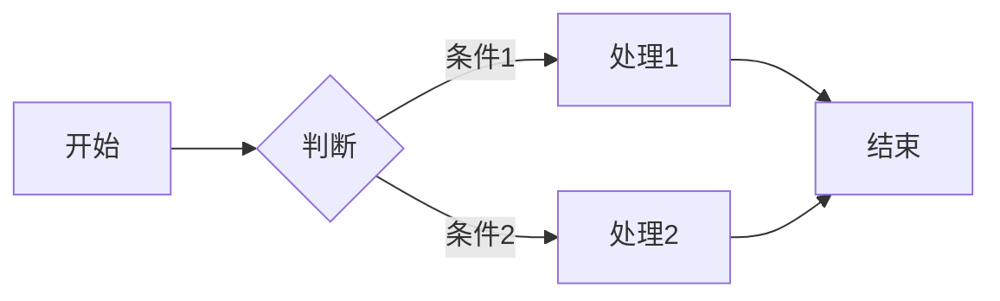
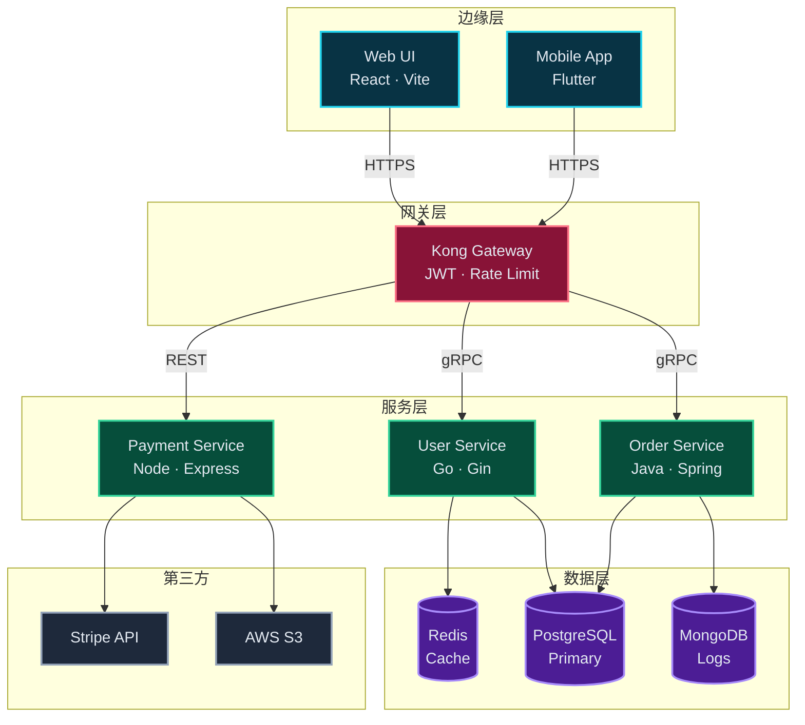

````markdown
# Markdown 综合示例文档

这是一个展示 **GitHub Flavored Markdown** 各种元素的示例文档，包含数学公式、图表、代码等。

## 1. 文本格式

你可以使用 *斜体*、**粗体**、***粗斜体***，或者 ~~删除线~~。还可以使用 <sub>下标</sub> 和 <sup>上标</sup>。

## 2. 列表

### 无序列表
- 项目 A
- 项目 B
  - 子项目 B1
  - 子项目 B2

### 有序列表
1. 第一步
2. 第二步
3. 第三步

### 任务列表
- [x] 已完成任务
- [ ] 待办任务
- [ ] 另一个待办

## 3. 代码

行内代码：`printf("Hello World")`

围栏代码块：

```python
def fibonacci(n):
    if n <= 1:
        return n
    return fibonacci(n-1) + fibonacci(n-2)
```

## 4. 数学公式

行内公式示例：E = mc^2 和 a^2 + b^2 = c^2

显示公式（微积分基本定理）：


\frac{d}{dx}\left( \int_{a(x)}^{b(x)} f(x,t) \, dt \right) = f(x,b(x)) \cdot b'(x) - f(x,a(x)) \cdot a'(x) + \int_{a(x)}^{b(x)} \frac{\partial}{\partial x} f(x,t) \, dt


矩阵示例：


\begin{pmatrix}
a_{11} & a_{12} & a_{13} \\
a_{21} & a_{22} & a_{23} \\
a_{31} & a_{32} & a_{33}
\end{pmatrix}
\cdot
\begin{pmatrix}
x_1 \\
x_2 \\
x_3
\end{pmatrix}
=
\begin{pmatrix}
b_1 \\
b_2 \\
b_3
\end{pmatrix}


## 5. 图表

### 简单流程图



### 系统架构图



## 6. 表格

| 功能 | 支持情况 | 备注 |
|:----|:-------:|-----:|
| 基础语法 | ✅ | 完全支持 |
| 数学公式 | ✅ | LaTeX 渲染 |
| Mermaid 图表 | ✅ | 流程图与架构图 |
| 代码高亮 | ✅ | 语法着色 |

## 7. 引用与注释

> Markdown 是一种轻量级标记语言，创始人为约翰·格鲁伯（John Gruber）。
> 
> 它允许人们使用易读易写的纯文本格式编写文档[^1]。

[^1]: 这是脚注的示例内容，用于引用说明。

## 8. 链接与图片

[GitHub 首页](https://github.com)


## 9. 水平分隔线

---

## 10. 折叠内容

<details>
<summary>点击展开技术细节</summary>

### 隐藏的内容

支持 **Markdown** 格式，包括：

- 列表项
- `代码`
- 以及其他 *格式*

</details>

## 11. 定义列表

术语一
:   定义一的内容说明

术语二
:   定义二的内容说明
:   另一个定义说明

## 12. 数学符号参考

常用希腊字母：\alpha、\beta、\gamma、\Gamma、\delta、\Delta、\theta、\lambda、\sigma、\Sigma

求和与积分：\sum_{i=1}^{n} x_i 和 \int_{0}^{\infty} e^{-x} dx

集合符号：\forall x \in \mathbb{R}，\exists y \in \mathbb{N}，A \subseteq B，x \in \emptyset
````
