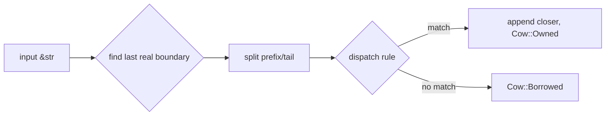

流式 markdown 渲染的核心难题是 **每个 token 边界**上,下游 parser 都要在多种可能的解释之间选择。

考虑这样一个场景:LLM 刚吐出 `Hello **wor`——这里的 `**` 可能是 `**bold**` 的开头,也可能只是字面量星号后接单词。传统做法是让 parser 做 tolerant recovery——但 recovery 的结果会随着后续 token 到达而翻转,直接后果是 DOM 重建、高亮缓存失效、mermaid 重跑。

## 数学表达

remend 的不变量可以这样表述:对任意输入 $s$,令 $r = \text{remend}(s)$,则 $r$ 在某个参考 CommonMark parser 下是 well-formed 的,并且 $\text{remend}(r) = r$(幂等性)。换言之:

$$
\forall s \in \text{UTF-8},\ \text{remend}(\text{remend}(s)) = \text{remend}(s)
$$

## Rust 示例

下面是一段示意实现的骨架:

```rust
pub fn remend(src: &str) -> Cow<'_, str> {
    let boundary = find_last_real_block_boundary(src);
    let (prefix, tail) = src.split_at(boundary);

    match dispatch_rule(tail) {
        Some(closer) => {
            let mut out = String::with_capacity(src.len() + closer.len());
            out.push_str(prefix);
            out.push_str(tail);
            out.push_str(&closer);
            Cow::Owned(out)
        }
        None => Cow::Borrowed(src),
    }
}
```

注意 `find_last_real_block_boundary` 必须维护 fence 栈,因为 fence 内部的 `\n\n` 不是边界。

## 流程图



## 注意事项

- 对于 `snake_case_identifier` 这类,CommonMark §6.4 已经禁止 `_` intraword italic。详见 [规范原文](https://spec.commonmark.org/0.31.2/#emphasis-and-strong-emphasis)。
- 对于 `*` 和 `**`,§6.4 允许 intraword——但 remend 主动收紧,拒绝合成。
- CJK 场景下 `中文**加粗**中文` 同样不合成,因为两侧都是 word char。

## 未完成的 tail 例子

最后演示 remend 在 tail 处的行为。假设 LLM 流到这里停了:

> 关键的 observation 是 `remend` 的 cost 在 **streaming**
